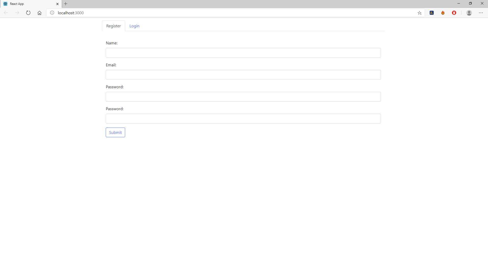
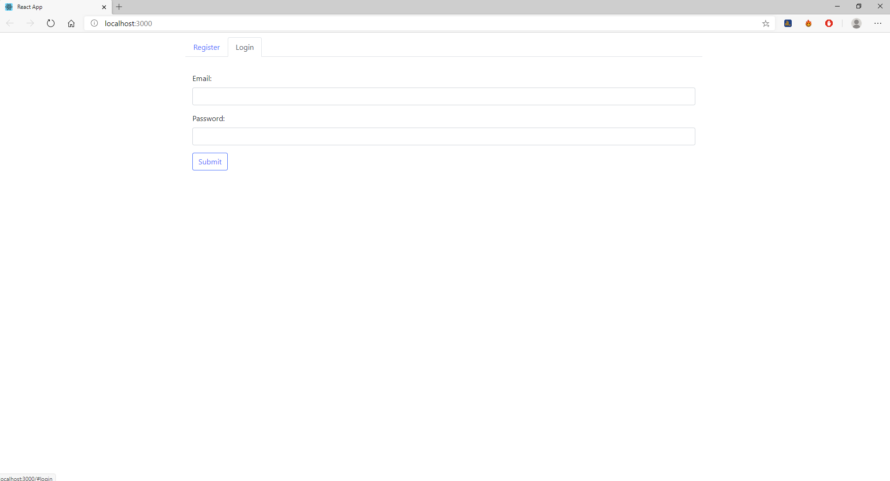
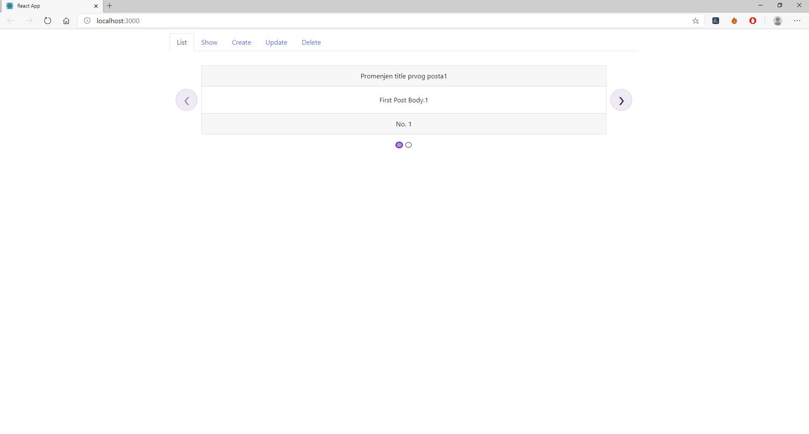
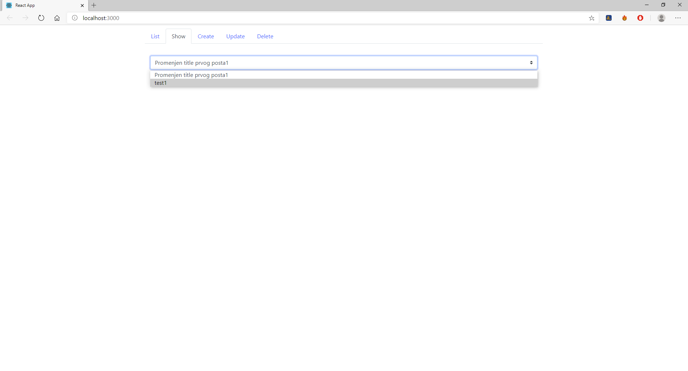
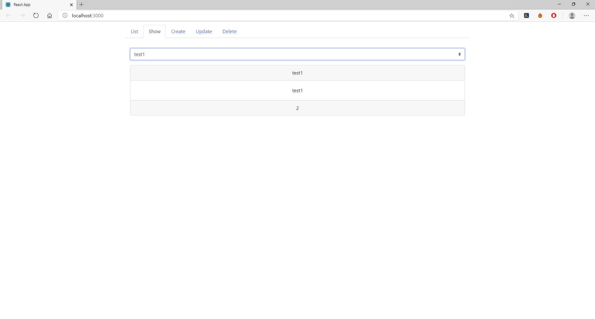
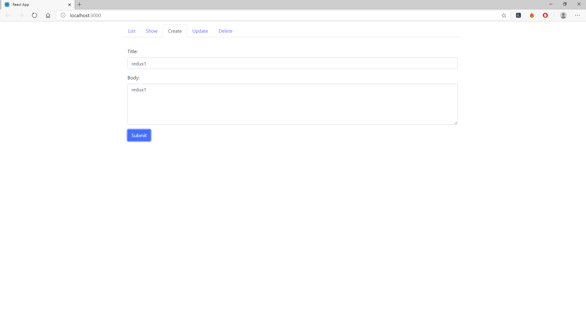
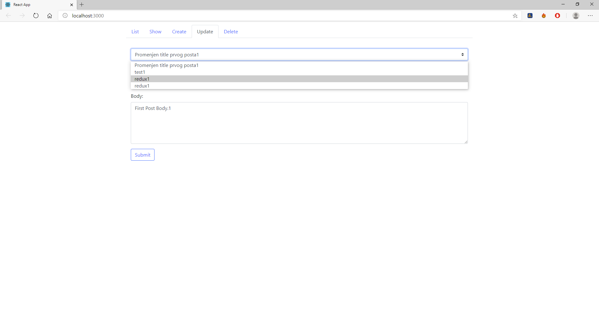
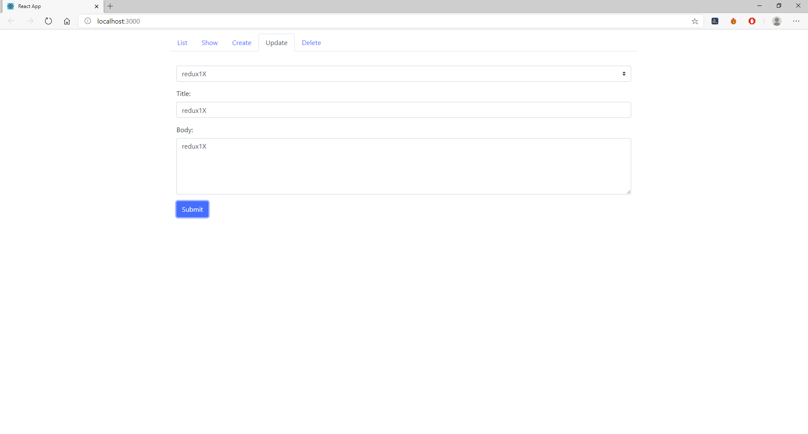
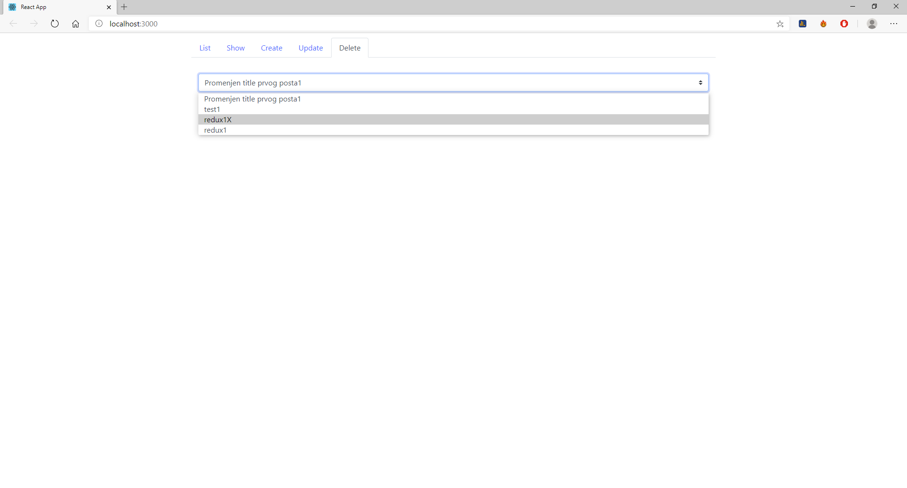
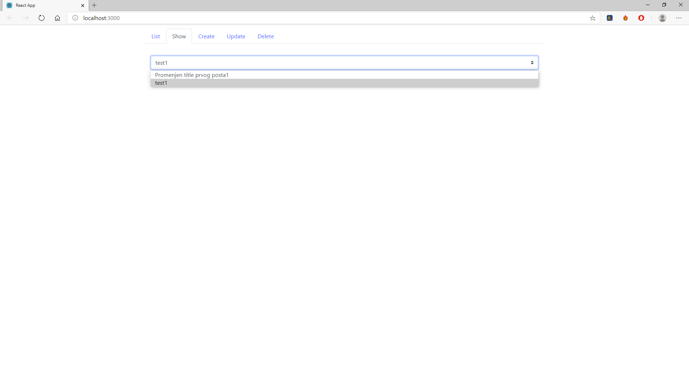

### An Frontend solution 

For my LaravelPassportApi which you can find here: [API](https://github.com/codename11/LaravelPassportApi).

I used Bootstrap's tab navbar for simplicity sake with coop between React with Redux.

Here are some screenshots:

Register user:

Login user:

List all posts:

Show particular post, for this i used [carousel](https://www.npmjs.com/package/react-elastic-carousel).

Create new post:

Update existing post:

Delete post:

As you can, visually is simple, still all conventions of React and Redux is up to the par and letter.
